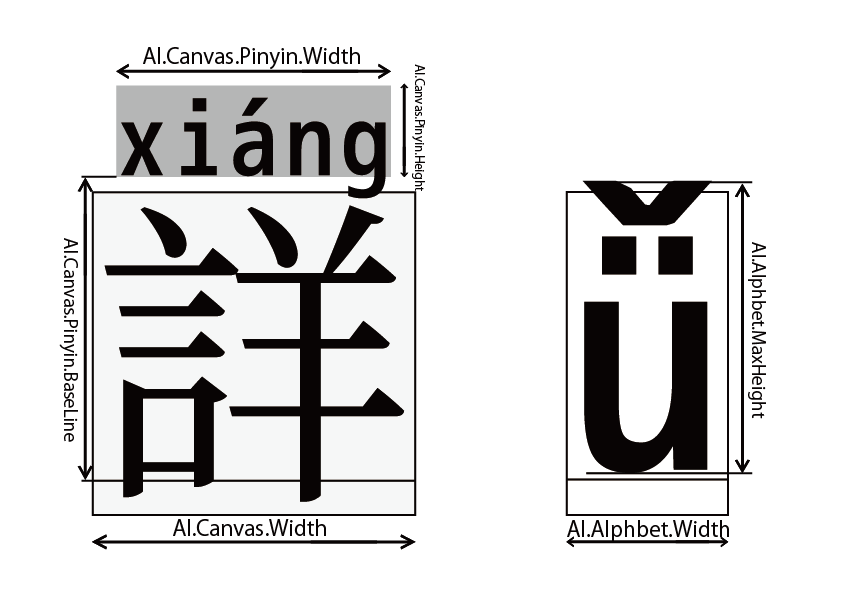
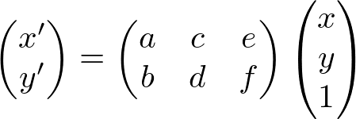
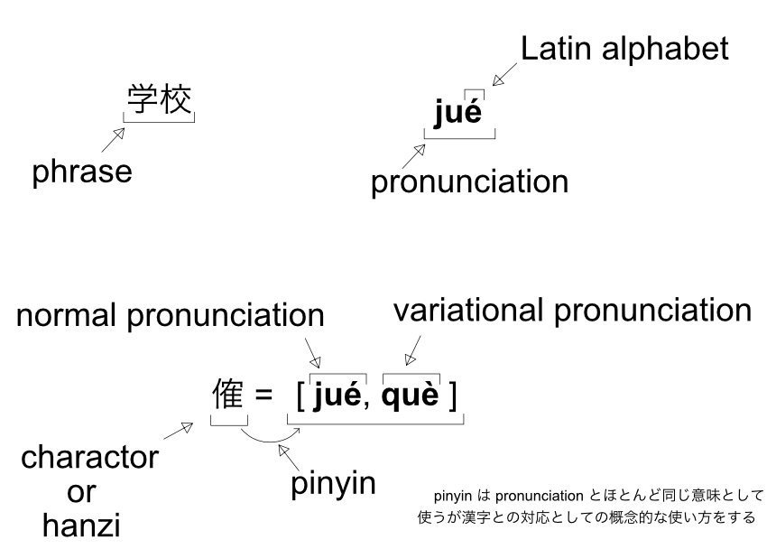

# How to make pinyin-font

## Requirement

- Display pinyin for both Simplified and Traditional Chinese
- The scope of Simplified Chinese characters is based on the *[Table of General Standard Chinese Characters](https://en.wikipedia.org/wiki/Table_of_General_Standard_Chinese_Characters)* ([通用规范汉字表](https://blogs.adobe.com/CCJKType/2014/03/china-8105.html))
- The scope of Traditional Chinese characters is based on the *[Big-5-2003](https://en.wikipedia.org/wiki/Big5)* ([五大碼-2003](https://moztw.org/docs/big5/))
- The scope of Japanese Kanji is based on the *[Jōyō_kanji](https://en.wikipedia.org/wiki/J%C5%8Dy%C5%8D_kanji)* ([常用漢字表（平成22年内閣告示第2号）](https://www.bunka.go.jp/kokugo_nihongo/sisaku/joho/joho/kijun/naikaku/kanji/))
- Hiragana (e.g.:あ) and katakana (e.g.:ア) are available

The font used here is based on [Source-Han-TrueType](https://github.com/Pal3love/Source-Han-TrueType).
This is a TTF version of [Source Han Sans](https://github.com/adobe-fonts/source-han-sans)/[Source Han Serif](https://github.com/adobe-fonts/source-han-serif) with reduced file size. All required Chinese characters are included.

## Dependencies
- macOS 10.15(Catalina)
- python 3.7
- otfcc

### python
```
$ pyenv global 3.7.2
$ pip install -r requirements.txt
```

### otfcc
[otfcc](https://github.com/caryll/otfcc) is lightweight and support IVS

```
# Install Xcode by mas-cli
$ mas install 497799835
# Note: Xcode initially gets an error because the [Command line Tools:] list box is blank.
# The following solutions will fix this problem.
# Refer to [エラー：xcode-select: error: tool 'xcodebuild' requires Xcode, but active developer directory '/Library/Developer/CommandLineTools' is a command line tools instance](https://qiita.com/eytyet/items/59c5bad1c167d5addc68)

# Install otfcc
$ brew tap caryll/tap 
$ brew install otfcc-mac64
```


## Generation procedure
1. Making a homograph dictionary  
[to details](./res/phonics/duo_yin_zi/README.md)  
```
$ cd <PROJECT-ROOT>/res/phonics/duo_yin_zi/scripts/
$ python make_pattern_table.py
```

2. Make an unicode table of the target Chinese characters  
[to details](./res/phonics/unicode_mapping_table/README.md) 
```
$ cd <PROJECT-ROOT>/res/phonics/unicode_mapping_table/
$ python make_unicode_pinyin_map_table.py 
```

3. Dump the base font to an editable file (json)
The glyf table is too large and inconvenient to browse, so it should be separated from the other tables.  
```
$ cd <PROJECT-ROOT>
$ python src/make_template_jsons.py <BASE-FONT-NAME>
# e,g.:
# python src/make_template_jsons.py ./res/fonts/SourceHanSerifCN-Regular.ttf
```

4. Extraction of latin characters for display at Pinyin  
**Note: Fixed-width latin alphabet fonts only**
```
$ cd <PROJECT-ROOT>
$ python src/retrieve_latin_alphabet.py <FONT-NAME-FOR-PINYIN>
# e,g.:
# python src/retrieve_latin_alphabet.py ./res/fonts/mplus-1m-medium.ttf
```

5. Build the font
```
$ cd <PROJECT ROOT>
$ time python3 src/main.py
```

## Technical Notes
### How to set the canvas size of the pinyin display area

  

```
    METADATA_FOR_PINYIN = {
        "pinyin_canvas":{
            "width"    : 850,   # The width of the canvas.
            "height"   : 283.3, # The height of the canvas.
            "base_line": 935,   # The height from the bottom of the Chinese character canvas to pinyin canvas.
            "tracking" : 22.145 # Character spacing in the pinyin display area (Tracking is about uniform spacing across a text selection).
        },
        "expected_hanzi_canvas":{
            "width" : 1000, # Expected Width of the Chinese character canvas.
            "height": 1000, # Expected height of the Chinese character canvas.
        }
    }
```
refer to [pinyin_glyph.py](./src/pinyin_glyph.py#L13)


### Componentization of the glyfs
glyf can be componentized and referenced.
You can reduce the volume by reusing them, and since they are placed by affine transformation, you can easily set their size and position.

Reference usage examples:
```
"cid48219": {
  "advanceWidth": 2048,
  "advanceHeight": 2628.2,
  "verticalOrigin": 1803,
  "references": [
    {
      "glyph": "arranged_ji1", "x": 0, "y": 0, "a": 1, "b": 0, "c": 0, "d": 1
    },
    {
      "glyph": "cid48219.ss00", "x": 0, "y": 0, "a": 1, "b": 0, "c": 0, "d": 1
    }
  ]
},
```

[Apple-The 'glyf' table](https://developer.apple.com/fonts/TrueType-Reference-Manual/RM06/Chap6glyf.html)
> The transformation entries determine the values of an affine transformation applied to the component prior to its being incorporated into the parent glyph. Given the component matrix [a b c d e f], the transformation applied to the component is:

In the reference, a-d is the value of the affine transformation.
In this tool, using a,d (scale) and x,y (move).

**Note: For unknown reasons, otfccbuild lost glyphs if a and d are the same value. If the sizes are different, it will be reflected, so set a=0.9, d=0.91 for 90%.**  
refer to [pinyin_glyph.py](./src/pinyin_glyph.py#L148)

<!--
\begin{align*}
  \begin{pmatrix}
    x' \\
    y' \\
  \end{pmatrix}
    =
  \begin{pmatrix}
    a & c & e \\
    b & d & f \\
  \end{pmatrix}
  \begin{pmatrix}
    x \\
    y \\
    1 \\
  \end{pmatrix}
\end{align*}
 -->
  
<!-- Ref.[extract rotation, scale values from 2d transformation matrix](https://stackoverflow.com/questions/4361242/extract-rotation-scale-values-from-2d-transformation-matrix)  
Matrix can calculate the scale, rotation, and shift at one time by raising the dimension.   -->

### feature tag
"aalt" is set to display the alternative characters.  

- "aalt_0" is set to "gsub_single". In use case, a symbol character and when the pronunciation changes only one Chinese character.
- "aalt_1" is set to "gsub_alternate". In use case, When the pronunciation changes more than two Chinese characters.


"rclt" is used for homograph substitution.
This feature is used for chaining contextual substitution

- "pattern one" is pattern of the pronunciation changes only one Chinese character.
- "pattern two" is pattern of the pronunciation changes more than two Chinese characters.
- "exception pattern" is pattern of the duplicates that affect phrases of pattern one or two.  
  [to details](./res/phonics/duo_yin_zi/README.md)


# Specifications (constraints)
- This font assumes horizontal writing only  
- The glyf table can only store up to 65536  
- The glyf table is large, save it as another json  
- The only font that can be used as a glyf is Fixed-width latin alphabet only
- The json of the standard python library becomes bloated and slow when converted to dict, so use [orjson](https://github.com/ijl/orjson)  
    Refer to [Choosing a faster JSON library for Python](https://pythonspeed.com/articles/faster-json-library/),  
    [PythonのJSONパーサのメモリ使用量と処理時間を比較してみる](https://postd.cc/memory-use-and-speed-of-json-parsers/)
- ssNN range from ss00 - 20  
    Refer to [Tag: 'ss01' - 'ss20'](https://docs.microsoft.com/en-us/typography/opentype/spec/features_pt#-tag-ss01---ss20)
- Chinese Pinyin is simplified in the glyf table (yī -> yi1)
- Exclude the specific pronunciations(e.g: 呣 m̀, 嘸 m̄) as that is not included in unicode

- [overwrite.txt](/res/phonics/unicode_mapping_table/overwrite.txt) has been added phrase for various purposes 
    1. Register Pinyin that can not be acquired by pypinyin
    2. Adjust the priority of pronunciation
    3. Add the pronunciation of the "儿" as "r"
    4. Add light tone(轻声), Integrate pronounce of the duplicate Chinese characters
    5. Exclude the specific pronunciations(e.g: 呣 m̀, 嘸 m̄)
  

- IVS responds as follows:

| code | Pinyin glyf |
| ---: | :--- |
| 0xE01E0 | None. Chinese character only |
| 0xE01E1 | With the standard pronunciation |
| 0xE01E2 | With the variational pronunciation |

  

- The correspondence between ssNN and Pinyin is as follows:

    -> If you don't put the standard pronunciation in ssNN, GSUB will immediately return to the original state when reverting to the standard reading in cmap_uvs.   
       Therefore, prepare a glyph for reverting to the standard pronunciation in ss01.  

| Naming Rules | glyf type |
| :--- | :--- |
| hanzi_glyf | Chinese character glyf with the standard pronunciation |
| hanzi_glyf.ss00 | Chinese character glyf without Pinyin. Pinyin can be changed by simply changing the IVS code. |
| hanzi_glyf.ss01 | (When Chinese character has the variational pronunciation) <br> Chinese character glyf with the standard pronunciation (duplicates with hanzi_glyf, but replaces it by overriding GSUB replacements) |
| hanzi_glyf.ss02 | (When Chinese character has the variational pronunciation) <br> After that, Chinese character glyf with the variational pronunciation |

  
  
- The name of the lookup table is free, but it obeys the following rules to reveal the reference source

| lookup table name | reference source |
| ---: | :--- |
| lookup_pattern_0N | pattern one |
| lookup_pattern_1N | pattern two |
| lookup_pattern_2N | exception pattern |
  
  
-  The order of 1~n in [duoyinzi_pattern_one.txt](./outputs/duoyinzi_pattern_one.txt) follows [marged-mapping-table.txt](./outputs/marged-mapping-table.txt), If order is 1 as the standard reading. Is order sequence match with ss0N. 

e.g.:  
```
U+5F3A: qiáng,qiǎng,jiàng  #强
```
```
1, 强, qiáng, [~调|~暴|~度|~占|~攻|加~|~奸|~健|~项|~行|~硬|~壮|~盗|~权|~制|~盛|~烈|~化|~大|~劲]
2, 强, qiǎng, [~求|~人|~迫|~辩|~词夺理|~颜欢笑]
3, 强, jiàng, [~嘴|倔~]
```
  

- lookup rclt summarizes the reading pattern by. rclt0 is "pattern one".  rclt1 is "pattern two"。 rclt2 is "exception pattern".  
- [duoyinzi_pattern_two.json](./outputs/duoyinzi_pattern_two.json) and [duoyinzi_exceptional_pattern.json](./outputs/duoyinzi_exceptional_pattern.json) a notation similar to [Glyphs](https://glyphsapp.com/) and [OpenType™ Feature File](http://adobe-type-tools.github.io/afdko/OpenTypeFeatureFileSpecification.html#5.f) 
- ignore tag specifies the phrase to be affected. And attach a single quote to a specific character that is affected. 
    Refer to ignore tag in [duoyinzi_exceptional_pattern.json](./outputs/duoyinzi_exceptional_pattern.json).

# Terminology used


# Collection of Chinese characters that are not found in `pypinyin`
[FIX_PINYIN.md](FIX_PINYIN.md)


# References
## Heteronyms ([多音字](https://zh.wikipedia.org/wiki/%E5%A4%9A%E9%9F%B3%E5%AD%97))
- [中国語の多音字辞典（Chinese Duoyinzi Dictionary）](https://dokochina.com/duoyinzi.htm)
- [ユーウェン中国語講座 - 多音字](https://yuwen.zaich.com/intermediate/duoyinzi)
- [常用多音字表](http://xh.5156edu.com/page/18317.html)
- [104个汉字多音字一句话总结](http://news.sina.com.cn/c/2017-03-19/doc-ifycnikk1155875.shtml)

## Dictionary Sites
- [baidu汉语](https://hanyu.baidu.com/)
- [汉典](https://www.zdic.net/)

## Opentype Specification
- [OpenType™ Feature File Specification](http://adobe-type-tools.github.io/afdko/OpenTypeFeatureFileSpecification.html#5f-gsub-lookuptype-6-chaining-contextual-substitution)
- [西暦表記を元号による表記にするフォント](http://mottainaidtp.seesaa.net/article/425166883.html)
- [IVD/IVSとは](https://mojikiban.ipa.go.jp/1292.html)
- [OpenType フォント・フォーマット](https://aznote.jakou.com/prog/opentype/index.html)
