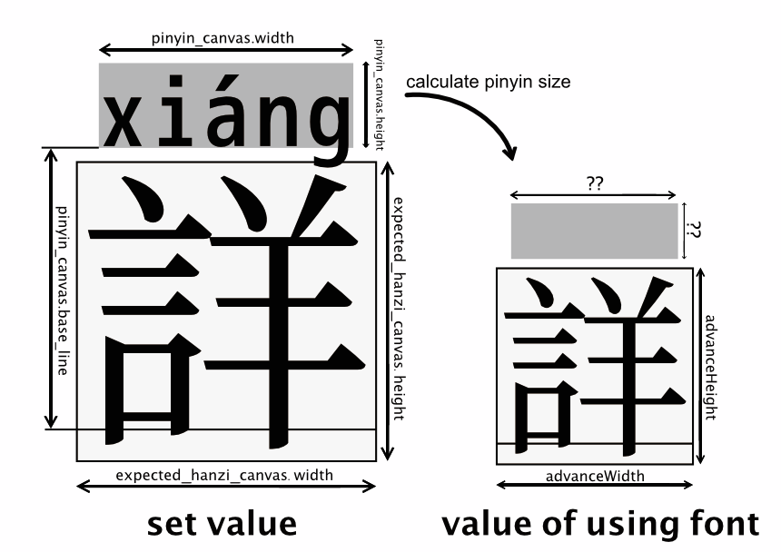

# How to make pinyin-font

## Requirement

- Display pinyin for both Simplified and Traditional Chinese
- The scope of Simplified Chinese characters is based on the *[Table of General Standard Chinese Characters](https://en.wikipedia.org/wiki/Table_of_General_Standard_Chinese_Characters)* ([通用规范汉字表](https://blogs.adobe.com/CCJKType/2014/03/china-8105.html))
- The scope of Traditional Chinese characters is based on the *[Big-5-2003](https://en.wikipedia.org/wiki/Big5)* ([五大碼-2003](https://moztw.org/docs/big5/))
- The scope of Japanese Kanji is based on the *[Tōyō kanji List (mainly Shinjitai)](https://en.wikipedia.org/wiki/Shinjitai)* ([当用漢字字体表（i.e.:新字体）](https://kotobank.jp/word/%E6%96%B0%E5%AD%97%E4%BD%93-537633))
- Japanese new glyphs/*Shinjitai* (新字体) that can be displayed are limited to the extent of *[Jōyō_kanji](https://en.wikipedia.org/wiki/J%C5%8Dy%C5%8D_kanji)* ([常用漢字](https://kanji.jitenon.jp/cat/joyo.html))
- Hiragana (e.g.:あ) and katakana (e.g.:ア) are available

The font used here is based on [Source-Han-TrueType](https://github.com/Pal3love/Source-Han-TrueType).
This is a TTF version of [Source Han Sans](https://github.com/adobe-fonts/source-han-sans)/[Source Han Serif](https://github.com/adobe-fonts/source-han-serif) with reduced file size. All required Chinese characters are included.

## Dependencies

```
$ pyenv global 3.7.2
$ pip install -r requirements.txt
```

```
# Used in GUI
$ brew cask install xquartz
# fontforge installation
$ brew install fontforge
# When the fontforge command doesn't work
$ brew link fontforge
# GUI version installation
$ brew cask install fontforge
```

## Generating configuration file

```
# Make a list of target chinese characters
$ python createHanziUnicodeJson.py
# Create unicode and cid mapping table from a CMAP table.
$ python createUnicode2cidJson.py fonts/SourceHanSerifCN-Regular.ttf
```

## Extracting characters for pinyin
Only fixed-width English fonts are supported.
Save the font to "fonts/pinyin_alphabets"

```
$ python getPinyinAlphbets.py fonts/mplus-1m-medium.ttf
```


|Character|File name|Change name|
|:--:|:-----:|:-----:|
|a| A.svg | a.svg |
|ā| Amacron.svg | ā.svg |
|á| Aacute.svg  | á.svg |
|ǎ| uni01CE.svg | ǎ.svg |
|à| Agrave.svg  | à.svg |
|b| B.svg | b.svg |
|c| C.svg | c.svg |
|d| D.svg | d.svg |
|e| E.svg | e.svg |
|ē| Emacron.svg | ē.svg |
|é| Eacute.svg  | é.svg |
|ě| Ecaron.svg  | ě.svg |
|è| Egrave.svg  | è.svg |
|f| F.svg | f.svg |
|g| G.svg | g.svg |
|h| H.svg | h.svg |
|i| I.svg | i.svg |
|ī| Imacron.svg | ī.svg |
|í| Iacute.svg  | í.svg |
|ǐ| uni01D0.svg | ǐ.svg |
|ì| Igrave.svg  | ì.svg |
|j| J.svg | j.svg |
|k| K.svg | k.svg |
|l| L.svg | l.svg |
|m| M.svg | m.svg |
|ḿ| uni1E3F.svg | ḿ.svg |
|n| N.svg | n.svg |
|ń| Nacute.svg  | ń.svg |
|o| O.svg | o.svg |
|ō| Omacron.svg | ō.svg |
|ó| Oacute.svg  | ó.svg |
|ǒ| uni01D2.svg | ǒ.svg |
|ò| Ograve.svg  | ò.svg |
|ở| uni1EDF.svg | ở.svg |
|p| P.svg | p.svg |
|q| Q.svg | q.svg |
|r| R.svg | r.svg |
|s| S.svg | s.svg |
|t| T.svg | t.svg |
|u| U.svg | u.svg |
|ū| Umacron.svg   | ū.svg |
|ú| Uacute.svg    | ú.svg |
|ǔ| uni01D4.svg   | ǔ.svg |
|ù| Ugrave.svg    | ù.svg |
|ü| Udieresis.svg | ü.svg |
|ǖ| uni01D6.svg   | ǖ.svg |
|ǘ| uni01D8.svg   | ǘ.svg |
|ǚ| uni01DA.svg   | ǚ.svg |
|ǜ| uni01DC.svg   | ǜ.svg |
|v| V.svg | v.svg |
|w| W.svg | w.svg |
|x| X.svg | x.svg |
|y| Y.svg | y.svg |
|z| Z.svg | z.svg |

Create "metadata-for-pinyin.json".


```
{
  "AI":{
    "Canvas":{
      <!-- The width of the canvas -->
      "Width": 722.489,
      "Pinyin":{
        <!-- Canvas size of the pinyin display area -->
        "Width":614.4,
        "Height":204.8,
        <!-- The height from the botton of the canvas to the pinyin display area -->
        "BaseLine":675.84,
        <!-- Character spacing in the pinyin display area -->
        "DefaultTracking":16
      }
    },
    "Alphbet":{
      <!-- The width of the pinyin display area -->
      "Width":176.389,
      <!-- The height of highest character in pinyin (probably:ǘ ǚ ǜ) -->
      "MaxHeight":319.264
    }
  },
  "SVG":{
    <!-- The width of viewBox -->
    "Width":2048,
    <!-- The scale of chinese character -->
    "Hanzi":{
      "Scale":{
        "X":1,
        "Y":1
      },
      <!-- The translation of chinese character  -->
      "Translate":{
        "X":0,
        "Y":0
      }
    }
  }
}
```

## Extract the target Chinese characters
Extracting SVGs of Chinese characters from font
```
$ python font2svgs.py fonts/SourceHanSerifCN-Regular.ttf
```

## Writing pinyin into Chinese characters
```
$ python pinyinFont.py fonts/SVGs fonts/pinyin_alphbets jsons/unicode-cid-mapping.json jsons/hanzi-and-pinyin-mapping.json jsons/metadata-for-pinyin.json
```

## Delete characters that are not in the scope of project
```
$ python removeWithoutHanziSVG.py fonts/SVGs jsons/unicode-cid-mapping.json jsons/hanzi-and-pinyin-mapping.json
```

## Optimize SVGs
There are multiple transformations, so I'm going to combine them into one.
[SVGCleaner.app](https://github.com/RazrFalcon/svgcleaner-gui/releases) is used for its simplicity.

## Replace SVG to .glif
A .glif is a file with character outlines in [UFO](https://unifiedfontobject.org/).
The Unified Font Object (UFO) is a human readable, future proof format for storing font data.

Refer to *[extract rotation, scale values from 2d transformation matrix](https://stackoverflow.com/questions/4361242/extract-rotation-scale-values-from-2d-transformation-matrix)*
Matrix can calculate the scale, rotation, and shift at one time by raising the dimension.  
<!--
\begin{align*}
  \begin{pmatrix}
    x' \\
    y' \\
  \end{pmatrix}
    =
  \begin{pmatrix}
    a & c & e \\
    b & d & f \\
  \end{pmatrix}
  \begin{pmatrix}
    x \\
    y \\
    1 \\
  \end{pmatrix}
\end{align*}
 -->
  
Transformation matrix as a list of six. float values (e.g. -t "0.1 0 0 -0.1 -50 200", -t "a b c d e f")   
```
$ python svgs2glifs.py fonts/SVGs jsons/unicode-cid-mapping.json -w 2048 -H 2048 -t "1 0 0
1 0 0"
```
<!-- ```
$ python svg2glif.py fonts/SVGs/cid09502.svg out.glif -w 2048 -H 2048 -t "2 0 0 -2 0 0"
``` -->
<!-- ## otf -> ttf
```
$ python otf2ttf.py fonts/SourceHanSerifSC-Regular.otf
``` -->

## Convart TTF to UFO
Conversion using FontForge.
<!-- ```
$ fontforge -script ttf2ufo.pe fonts/SourceHanSerifCN-Regular.ttf
``` -->


## Move each .glif to UFO
Overwrite the "glyphs/\*.glif" that is output under "fonts/ufo/glyphs/\*.glif".
When I overwrite each glyphs, it doesn't work. Why, is it because of the Finder? So, move or copy them file by file.  
There are 16026 files.

## Assemble UFO to TTF
<!-- ```
$ fontforge -script ufo2ttf.pe fonts/SourceHanSerifCN-Regular.ufo
``` -->


# Collection of Chinese characters that are not found in `pypinyin`
[FIX_PINYIN.md](FIX_PINYIN.md)


# Ligatures
- [OpenType Cookbook](http://opentypecookbook.com/)
- [glyphs Ligatures](https://glyphsapp.com/tutorials/ligatures)
- [github ligatures](https://github.com/topics/ligatures)
- [kiliman/operator-mono-lig](https://github.com/kiliman/operator-mono-lig)
- [【完全版】Ligature Symbols フォントセットの自作方法](https://kudakurage.hatenadiary.com/entry/20120720/1342749116)

<!-- fontforge
ctrl + Shift + F -> Lookups
cid59875 -->

## Heteronyms ([多音字](https://zh.wikipedia.org/wiki/%E5%A4%9A%E9%9F%B3%E5%AD%97))
- [中国語の多音字辞典（Chinese Duoyinzi Dictionary）](https://dokochina.com/duoyinzi.htm)
- [常用多音字表](http://xh.5156edu.com/page/18317.html)
- [104个汉字多音字一句话总结](http://news.sina.com.cn/c/2017-03-19/doc-ifycnikk1155875.shtml)
