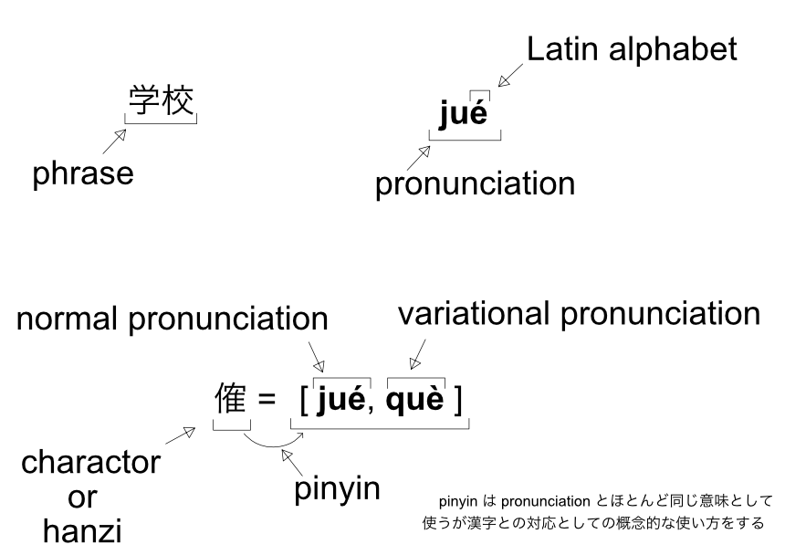

# pinyin font 作り方
## 要件

- 簡体字と繁体字の漢字は拼音が付く
- 簡体字の対象範囲は [通用规范汉字表](https://blogs.adobe.com/CCJKType/2014/03/china-8105.html) に準拠する
- 繁体字の対象範囲は [Big5( 大五碼 )-2003](https://moztw.org/docs/big5/) に準拠する
- 日本の漢字は[常用漢字表（平成22年内閣告示第2号）](https://www.bunka.go.jp/kokugo_nihongo/sisaku/joho/joho/kijun/naikaku/kanji/)に準拠する
- 「ひらがな」「カタカナ」を表示できる  


拼音を表示する対象は16026個ある。  

### ベースにしたフォント   
#### 宋体
[source-han-serif(思源宋体) otf](https://github.com/adobe-fonts/source-han-serif/tree/release/OTF) から、不要な文字を取り除いた [Source-Han-TrueType](https://github.com/Pal3love/Source-Han-TrueType) をベースにしている。  
拼音部分には M+ M Type-1 の [mplus-1m-medium.ttf](https://mplus-fonts.osdn.jp/about.html) を利用している。

#### 手書き風
[シャオライ/Xiaolai Font](https://github.com/lxgw/kose-font) をベースにしている。これはグリフ数削減のためにハングル文字(a960 #ꥠ ~ d7fb #ퟻ) を除去して使っている。  
拼音部分には [瀬戸フォント](https://ja.osdn.net/projects/setofont/releases/p14368) を利用している。


## 依存関係の解消
### otfcc
[otfcc](https://github.com/caryll/otfcc) は軽量で IVS にも対応している。  
```
# Xcode をインストールしておく
$ mas install 497799835
# Xcode は最初は [Command line Tools:] リストボックスが空欄になっているため、error になってしまう。
# 以下の対処をすると直る。
# [エラー：xcode-select: error: tool 'xcodebuild' requires Xcode, but active developer directory '/Library/Developer/CommandLineTools' is a command line tools instance](https://qiita.com/eytyet/items/59c5bad1c167d5addc68)

$ brew tap caryll/tap 
$ brew install otfcc-mac64
```

### python
```
$ pyenv global 3.8.2
$ pip install -r requirements.txt
```

## 生成手順
1. 多音字の辞書を作る(省略可能)  
[詳細へ](./res/phonics/duo_yin_zi/README.md)  
```
$ cd <PROJECT-ROOT>/res/phonics/duo_yin_zi/scripts/
$ python make_pattern_table.py
```

2. 対象の漢字の unicode テーブルを作る(省略可能)  
[詳細へ](./res/phonics/unicode_mapping_table/README.md)  
```
$ cd <PROJECT-ROOT>/res/phonics/unicode_mapping_table/
$ python make_unicode_pinyin_map_table.py 
```

<!-- 3. ベースにするフォントを編集可能の状態（json）にダンプする  
glyf table はサイズが大きく閲覧のときに不便なので他のテーブルと分離する。  
```
$ cd <PROJECT-ROOT>
$ python src/make_template_jsons.py <BASE-FONT-NAME>
# e,g.:
# python src/make_template_jsons.py ./res/fonts/han-serif/SourceHanSerifCN-Regular.ttf
```

4. 拼音表示のための文字を抽出する  
固定幅の英字フォントのみ対応  
```
$ cd <PROJECT-ROOT>
$ python src/retrieve_latin_alphabet.py <FONT-NAME-FOR-PINYIN>
# e,g.:
# python src/retrieve_latin_alphabet.py ./res/fonts/han-serif/mplus-1m-medium.ttf
``` -->

3. ビルドする  
```
$ cd <PROJECT ROOT>
```
```
$ time python src/main.py --style han_serif
```
or   
```
$ time python src/main.py --style handwritten
```


## 技術的メモ
### pinyin表示部のサイズ設定方法

  

```
    METADATA_FOR_PINYIN = {
        "pinyin_canvas":{
            "width"    : 850,   # 拼音表示部の幅
            "height"   : 283.3, # 拼音表示部の高さ
            "base_line": 935,   # ベースラインからの高さ
            "tracking" : 22.145 # 拼音の標準空白幅： Tracking is about uniform spacing across a text selection.
        },
        "expected_hanzi_canvas":{
            "width" : 1000, # 基準にする漢字の表示部の幅
            "height": 1000, # 基準にする漢字の表示部の高さ
        }
    }
```
refer to [pinyin_glyph.py](./src/pinyin_glyph.py#L13)

### グリフのコンポーネント化
グリフはコンポーネント化して参照することができる。
再利用によって容量を減らすことができ、アフィン変換で配置するのでサイズ・位置を簡単に設定できる。

参照の利用例：
```
"cid48219": {
  "advanceWidth": 2048,
  "advanceHeight": 2628.2,
  "verticalOrigin": 1803,
  "references": [
    {
      "glyph": "arranged_ji1", "x": 0, "y": 0, "a": 1, "b": 0, "c": 0, "d": 1
    },
    {
      "glyph": "cid48219.ss00", "x": 0, "y": 0, "a": 1, "b": 0, "c": 0, "d": 1
    }
  ]
},
```

[Apple-The 'glyf' table](https://developer.apple.com/fonts/TrueType-Reference-Manual/RM06/Chap6glyf.html)
> The transformation entries determine the values of an affine transformation applied to the component prior to its being incorporated into the parent glyph. Given the component matrix [a b c d e f], the transformation applied to the component is:

参照時に指定している a-d は、アフィン変換の値である。
今回は、「拡大縮小」と「平行移動」を使うので、a,d (scale) と x,y (move) を指定して使っている。

**注意：otfccbuild の仕様なのか opentype の仕様なのか分からないが a と d が同じ値だと、グリフが消失する。 少しでもサイズが違えば反映されるので、90% にするなら、a=0.9, d=0.91 とかにする。**  
refer to [pinyin_glyph.py](./src/pinyin_glyph.py#L148)

<!--
\begin{align*}
  \begin{pmatrix}
    x' \\
    y' \\
  \end{pmatrix}
    =
  \begin{pmatrix}
    a & c & e \\
    b & d & f \\
  \end{pmatrix}
  \begin{pmatrix}
    x \\
    y \\
    1 \\
  \end{pmatrix}
\end{align*}
 -->
  
<!-- Ref.[extract rotation, scale values from 2d transformation matrix](https://stackoverflow.com/questions/4361242/extract-rotation-scale-values-from-2d-transformation-matrix)  
Matrix can calculate the scale, rotation, and shift at one time by raising the dimension.   -->


### feature tag
aalt は代替文字の表示のために設定している。  
  aalt_0 は gsub_single. 拼音が一つのみの漢字 + 記号とか。置き換え対象が一つのみのとき
  aalt_1 は gsub_alternate. 拼音が複数の漢字

rclt は多音字の置換に利用している。この feature は (文脈連鎖依存の置換、文脈依存の異体字) の表示のために利用できる。  
  pattern one は 熟語の中で 1文字だけ拼音が変化するパターン  
  pattern two は 熟語の中で 2文字以上拼音が変化するパターン  
  exception pattern は 例外的なパターン  
  [詳細へ](./res/phonics/duo_yin_zi/README.md)

# 仕様（制約）
- このフォントは横書きのみ想定  
- glyf table は 65536 までしか格納できない  
- glyf table は大きいので別の json として保存している  
- 重複して定義されている漢字をグリフ数削減のために同一のグリフを参照するようにしている（ ⺎:U+2E8E, 兀:U+5140, 兀:U+FA0C と 嗀:U+55C0, 嗀:U+FA0D ）  
- 拼音のグリフとして使えるフォントは等幅英字のみ  
- python の標準ライブラリの json は dict に変換すると肥大化して遅くなるので、 [orjson](https://github.com/ijl/orjson) を利用する  
    refer to [Choosing a faster JSON library for Python](https://pythonspeed.com/articles/faster-json-library/), 
    [PythonのJSONパーサのメモリ使用量と処理時間を比較してみる](https://postd.cc/memory-use-and-speed-of-json-parsers/)


- ss00 - 20 まで  
    [Tag: 'ss01' - 'ss20'](https://docs.microsoft.com/en-us/typography/opentype/spec/features_pt#-tag-ss01---ss20)
- glyf table 内の 拼音 は簡易表記(yī -> yi1) にする  

- 呣 m̀, 嘸 m̄　は unicode に含まれていないので除外  
- [overwrite.txt](/res/phonics/unicode_mapping_table/overwrite.txt) は色々な目的のために追加している  
    pypinyin で取得できない漢字  
    発音の優先度の調整  
    儿 の r の追加  
    軽声の追加、重複する漢字は同じ発音にする  
    呣 m̀, 嘸 m̄　を除外するため（追加してもいいが拼音グリフを作るのが面倒になる）  

- IVS は  

| code | Pinyin glyf |
| ---: | :--- |
| 0xE01E0 | 何もないグリフ |
| 0xE01E1 | 標準的な拼音 |
| 0xE01E2 | 以降、異読の拼音 |

- ssXX と拼音の対応は以下のようにする  
    -> ssXX に標準的な拼音を入れないと cmap_uvs で標準の読みに戻す場合に、すぐにGSUBが効いて元に戻ってしまう。そのため、ss01 に標準的な拼音に戻す用のグリフを用意する. 

| 命名規則 | グリフタイプ |
| :--- | :--- |
| hanzi_glyf | 標準の読みの拼音 |
| hanzi_glyf.ss00 | 拼音の無い漢字グリフ。設定を変更するだけで拼音を変更できる |
| hanzi_glyf.ss01 | （異読の拼音があるとき）標準の読みの拼音（hanzi_glyf と重複するが GSUB の置換（多音字のパターン）を無効にして強制的に置き換えるため）|
| hanzi_glyf.ss02 |（異読の拼音があるとき）以降、異読な拼音 |

- lookup table の名前は自由だけど、どこから参照しているか分かりやすくするために名前を以下のようにする  

| lookup table name | reference source |
| ---: | :--- |
| lookup_pattern_0N | pattern one |
| lookup_pattern_1N | pattern two |
| lookup_pattern_2N | exception pattern |

- [duoyinzi_pattern_one.txt](./outputs/duoyinzi_pattern_one.txt) の 1~n の並びは、[marged-mapping-table.txt](./outputs/marged-mapping-table.txt) に従う。1 が標準的な読み. ss01 と合わせる  
    ```
    U+5F3A: qiáng,qiǎng,jiàng  #强
    ```
    ```
    1, 强, qiáng, [~调|~暴|~度|~占|~攻|加~|~奸|~健|~项|~行|~硬|~壮|~盗|~权|~制|~盛|~烈|~化|~大|~劲]
    2, 强, qiǎng, [~求|~人|~迫|~辩|~词夺理|~颜欢笑]
    3, 强, jiàng, [~嘴|倔~]
    ```

- lookup rclt は、読みのパターンごとにまとめる。 rclt0 は pattern one。 rclt1 は pattern two。 rclt2 は exception pattern.  
- [duoyinzi_pattern_two.json](./outputs/duoyinzi_pattern_two.json) と [duoyinzi_exceptional_pattern.json](./outputs/duoyinzi_exceptional_pattern.json) は Graphs like な記述  
- [duoyinzi_exceptional_pattern.json](./outputs/duoyinzi_exceptional_pattern.json) の ignore tag では 影響する漢字に ' をつける

# 利用している用語


# pypinyinで拼音が見つからない漢字まとめ
[FIX_PINYIN.md](FIX_PINYIN.md)

# 参考資料
## 多音字
- [中国語の多音字辞典（Chinese Duoyinzi Dictionary）](https://dokochina.com/duoyinzi.htm)
- [ユーウェン中国語講座 - 多音字](https://yuwen.zaich.com/intermediate/duoyinzi)
- [常用多音字表](http://xh.5156edu.com/page/18317.html)
- [104个汉字多音字一句话总结](http://news.sina.com.cn/c/2017-03-19/doc-ifycnikk1155875.shtml)

## 辞書サイト
- [baidu汉语](https://hanyu.baidu.com/)
- [汉典](https://www.zdic.net/)

## 規格
- [OpenType™ Feature File Specification](http://adobe-type-tools.github.io/afdko/OpenTypeFeatureFileSpecification.html#5f-gsub-lookuptype-6-chaining-contextual-substitution)
- [西暦表記を元号による表記にするフォント](http://mottainaidtp.seesaa.net/article/425166883.html)
- [IVD/IVSとは](https://mojikiban.ipa.go.jp/1292.html)
- [OpenType フォント・フォーマット](https://aznote.jakou.com/prog/opentype/index.html)