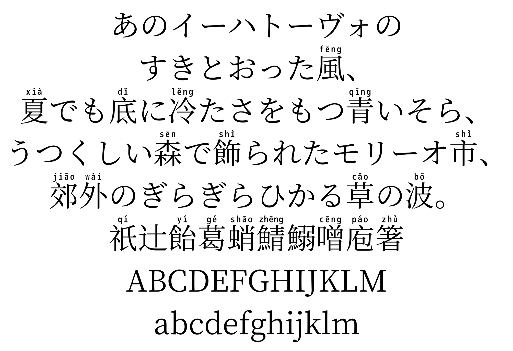
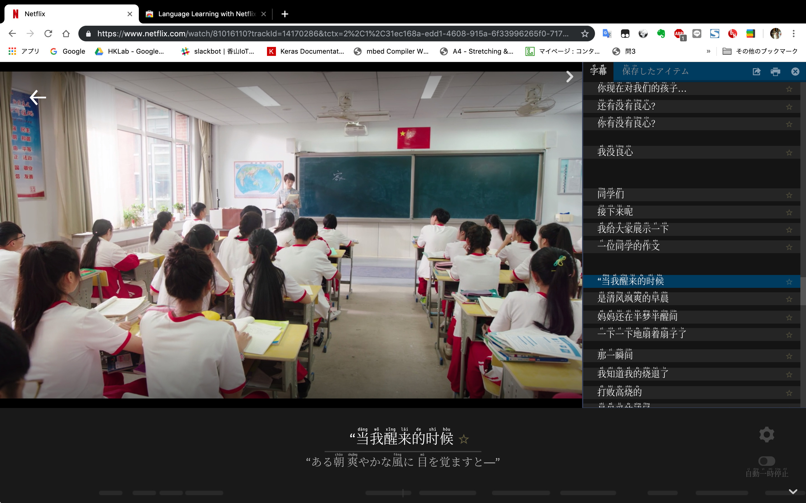

# Mengshen(萌神)-pinyin(拼音)-font
OpenSource Pinyin Font and that is created tools.

[Download](https://github.com/MaruTama/pinyin-font-tools/releases)

# Font Installation Instructions
- [macOS](https://support.apple.com/en-us/HT201749)
- [Windows](https://www.microsoft.com/en-us/Typography/TrueTypeInstall.aspx)
- [Linux/Unix-based systems](https://github.com/adobe-fonts/source-code-pro/issues/17#issuecomment-8967116)

# An example of how to use
Improve your skills on your own, effectively and enjoyably, by watching films and series in the language you study.  
Subtitles are shown hanzi and pinyin.  
[Language Learning with Netflix](https://chrome.google.com/webstore/detail/language-learning-with-ne/hoombieeljmmljlkjmnheibnpciblicm?hl=en)  

# How to make fonts
[link](./HOW_TO_MAKE.md)
