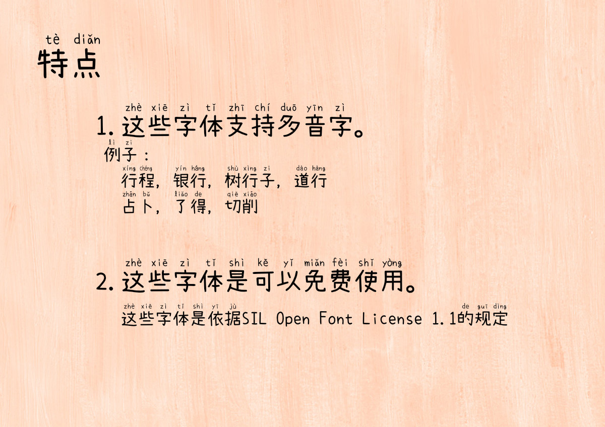
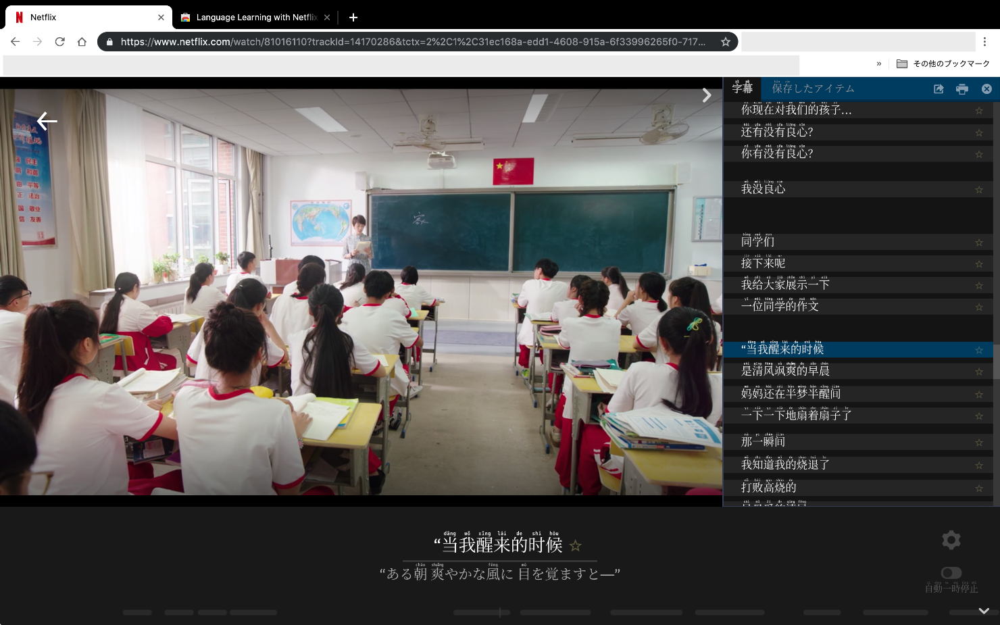

# Mengshen(萌神)-pinyin(拼音)-font
OSS の多音字に対応した拼音フォント及びその作成ツールです。 / OpenSource Pinyin font and creation tool that supports homograph (多音字).

**[Download/下载](https://github.com/MaruTama/pinyin-font-tools/releases)**  
<!--    -->

 
 

  
  
  

私達は中国語の学習や普及を目的としているグループです。/ We are a group dedicated to learning and promoting the Chinese language.  
- [萌神PROJECT](https://mengshen-project.com/)
- [「萌神フォント」誕生しました！](https://note.com/geekzhongwen/n/n7a6f26a885d1)
- [「萌神フォント」Ver.2ができました！](https://note.com/geekzhongwen/n/nf9552d4bdf66)
- [メイカーのための中国語入門 フォント指定だけで拼音がつく萌神フォント開発秘話編](https://booth.pm/ja/items/1888270)
----

## 目的 / Purpose
基本的な日本語、簡体字、繁体字を表示できるフォントであり、
簡体字と繁体字には拼音を併記するフォントの作成です。/
This fonts can display basic Japanese, Simplified Chinese and Traditional Chinese, and We created a font that includes Chinese romanization for both Simplified and Traditional chinese characters.

----

## 想定利用者 / Target User
日本語、中国語の学習者 / Japanese and Chinese language learners

----

# フォントのインストール方法 / Font Installation Instructions
- [macOS](https://support.apple.com/en-us/HT201749)
- [Windows](https://support.microsoft.com/en-us/help/314960/how-to-install-or-remove-a-font-in-windows)
- [Linux/Unix-based systems](https://github.com/adobe-fonts/source-code-pro/issues/17#issuecomment-8967116)

----

# 使用例 / use case
e.g. 微博, Netflix, Lyrics, News, etc.

Improve your skills on your own, effectively and enjoyably, by watching films and series in the language you study.  
Subtitles are shown Chinese characters and pinyin.  
[Language Learning with Netflix](https://chrome.google.com/webstore/detail/language-learning-with-ne/hoombieeljmmljlkjmnheibnpciblicm?hl=en)  

----

# 技術的要素 / Technical elements
多音字をサポートするためにコンテキスト置換(feature tag of "rclt" at GSUB)を実装しました。
また、Unicode IVS（表意文字バリアントセレクター）を使用して、異なる拼音に切り替えることもできます。/
Implemented contextual replacing to support homograph (多音字).
You can also use Unicode IVS (ideographic variant selector) to switch other different pinyin.  
<!--  -->
  
  

----

# 対応している多音字の一覧 / List of supported homograph
- [supported homograph](./doc/DUOYINZI_DICTIONARY.md)

# 生成方法 / How to make fonts
- [日本語](./doc/HOW_TO_MAKE_JP.md)  
- [English](./doc/HOW_TO_MAKE_EN.md)

----

# 謝辞 / Acknowledgments
Thank you to the following people and repositories. 
- [@NightFurySL2001](https://github.com/NightFurySL2001)-san
- [BPMF IVS](https://github.com/ButTaiwan/bpmfvs)
- [kose-font](https://github.com/lxgw/kose-font)
- [SetoFontSP](https://ja.osdn.net/projects/setofont/releases/p14368)
- [Source-Han-TrueType](https://github.com/Pal3love/Source-Han-TrueType)
- [M+ M Type-1](https://mplus-fonts.osdn.jp/about.html)

----

## カンパ/打赏/Donate
[点击进入打赏页面](./doc/DONATE.md)
