# How to install mengshen font on Android

The method using zFont is compatible with Galaxy, LG, HUAWEI, vivo, Honor, OPPO, and Xiaomi devices. However, there are some apps that don't support homographs or are not fully compatible.

If you want to enable homographs or change the font in apps that don't support zFont(e.g. lock screen's clock / chrome), you can use the Magisk module.

## MIUI

I confirmed on Redmi Note 9S (MIUI 12).

1. Install and launch zFont.

   <!-- markdownlint-disable-next-line MD033 -->
   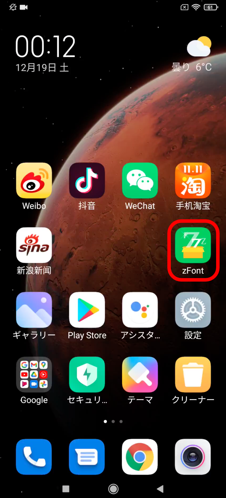

2. Go to the LOCAL tab and press the button in the bottom right.

   <!-- markdownlint-disable-next-line MD033 -->
   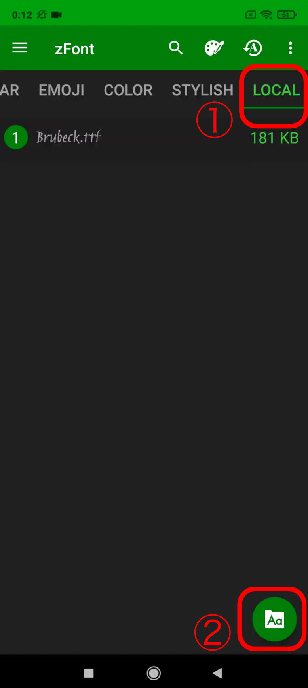

3. Choose Mengshen-HanSerif.ttf or Mengshen-Handwritten.ttf and check it.
   (Note: In the screenshot, Mengshen-Handwritten.ttf is renamed to mengshen.ttf)

   <!-- markdownlint-disable-next-line MD033 -->
   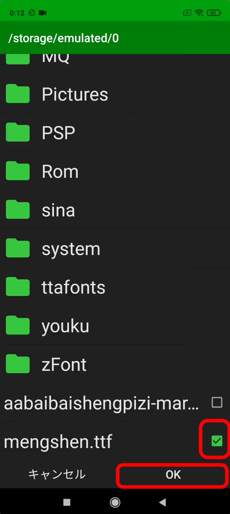

4. After verifying the font, press the SET button.

   <!-- markdownlint-disable-next-line MD033 -->
   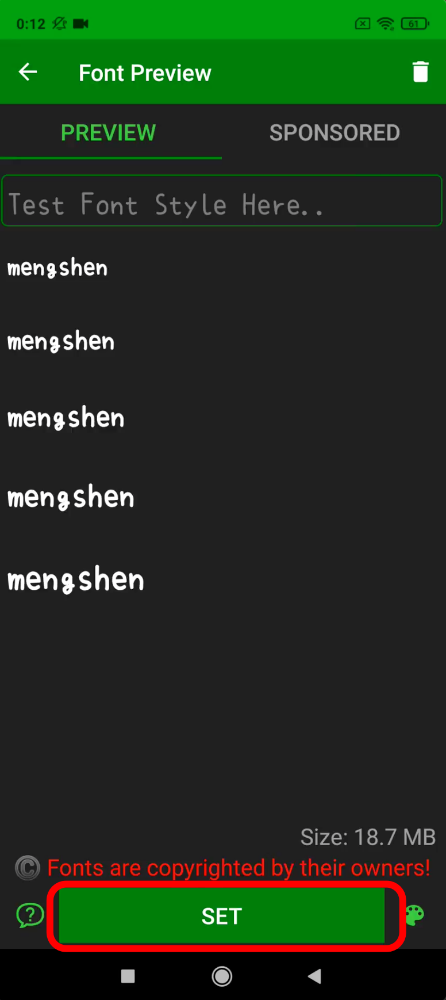

5. Click on Xiaomi(MIUI).

   <!-- markdownlint-disable-next-line MD033 -->
   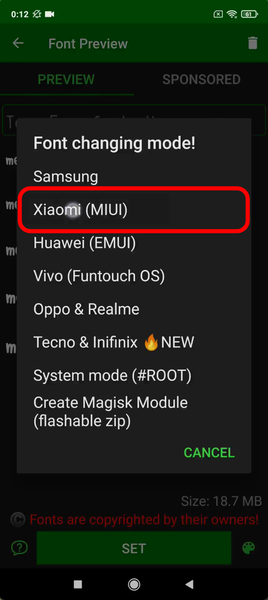

6. Click on Method3.
   (Note: Don't choose Method4. For some reason, it seems the font doesn't change.)

   <!-- markdownlint-disable-next-line MD033 -->
   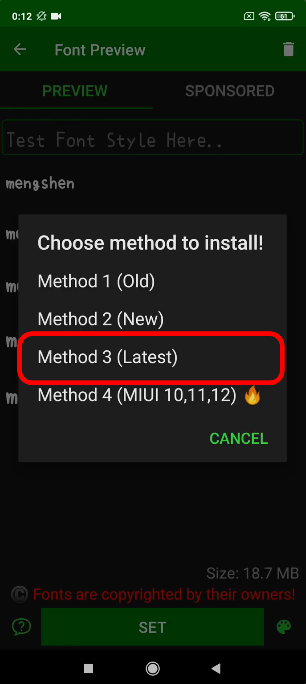

7. When the dialog appears, click OK.

   <!-- markdownlint-disable-next-line MD033 -->
   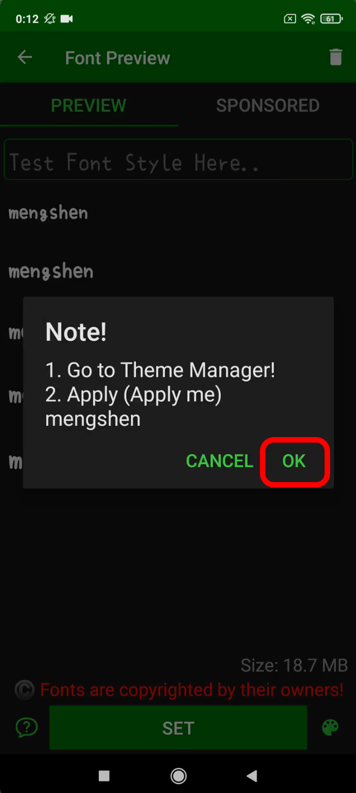

8. You will be automatically redirected to the theme app.

9. Select the theme with "(Apply me)" in its name.

   <!-- markdownlint-disable-next-line MD033 -->
   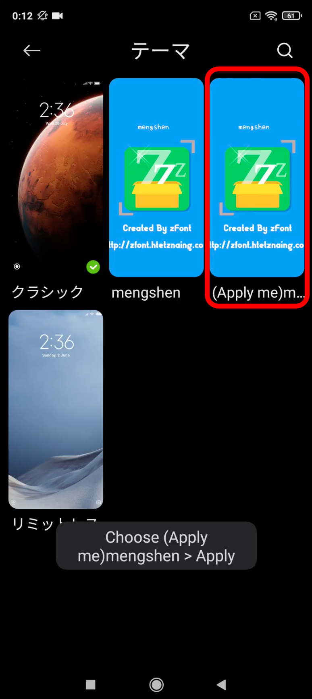

10. Press the apply button.
    Now you should see the pinyin font. If it doesn't change, try restarting.

    <!-- markdownlint-disable-next-line MD033 -->
    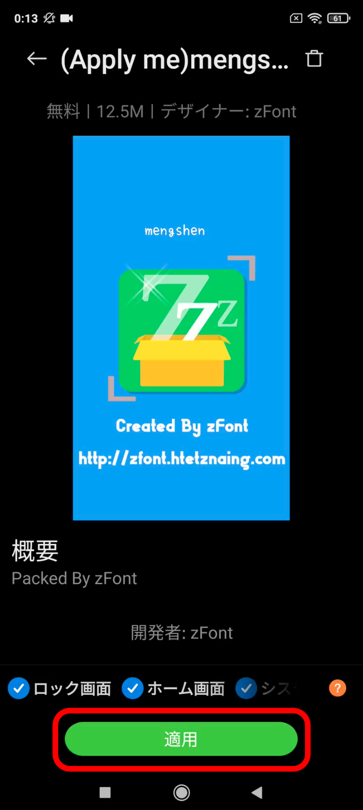

Now, you can read comments with pinyin in apps like Weibo and TikTok!
<!-- markdownlint-disable-next-line MD033 -->
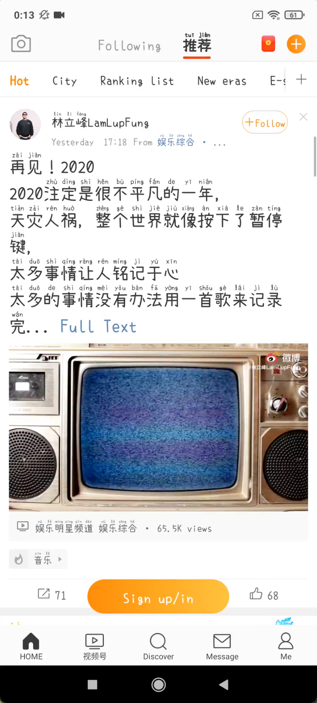
<!-- markdownlint-disable-next-line MD033 -->

<!-- markdownlint-disable-next-line MD033 -->
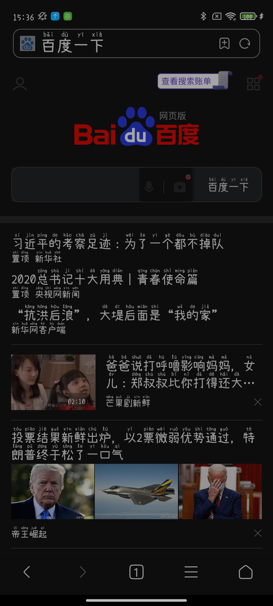

## Magisk Module (requires root)

It seems that from Android 10(Q), the EXT4 dedup filesystem was introduced, which prevents mounting in RW mode. However, it appears that the system area can still be modified as a Magisk module.
I confirmed on Redmi Note 9S (MIUI 12).

You can download the Magisk module ZIP file from [here](https://github.com/MaruTama/magisk-module-mengshen-font/releases) and install it using Magisk Manager. ([Source code is here](https://github.com/MaruTama/magisk-module-mengshen-font))

For installation instructions, refer to [detailed Magisk module installation guide on Android Police](https://www.androidpolice.com/install-magisk-rooted-android/).

## Reference

- [MIUI12 で萌神（拼音付き）フォントを適用させる。](https://note.com/tamamaru/n/n86ac40bd2c97)
- [Koruri フォントに置き変える Magisk モジュールをv20.2+向けに更新しました【要root】](https://androplus.org/Entry/12518/)
