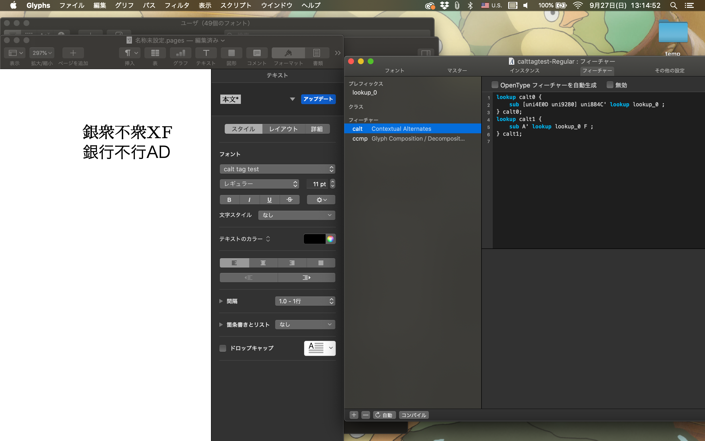

# error:
このエラーがあったが、[de0090a43d8a6a359d85d45e26e7cfa17b4cf5d8] で解消した
```
Exception: otfccbuild : Build : [WARNING] [Stat] Circular glyph reference found in gid 11663 to gid 11664. The reference will be dropped.
       |-Build : [WARNING] [Stat] Circular glyph reference found in gid 11664 to gid 11664. The reference will be dropped.
       |-Build : [WARNING] [Stat] Circular glyph reference found in gid 11665 to gid 11664. The reference will be dropped.
       |-Build : [WARNING] [Stat] Circular glyph reference found in gid 13827 to gid 13828. The reference will be dropped.
       |-Build : [WARNING] [Stat] Circular glyph reference found in gid 13828 to gid 13828. The reference will be dropped.
       |-Build : [WARNING] [Stat] Circular glyph reference found in gid 13829 to gid 13828. The reference will be dropped.
```
gid は glyph_order の添字
解決策としては[二回繰り返さないようにする。](https://github.com/MaruTama/Mengshen-pinyin-font/blob/e5d6e9e1770d849d6c17016683faf7c04d028473/src/font.py#L37-L58)
前提として、すべての文字に対して同じ発音が登録されていること。overwrite.txt で調整した。

|unicode|Integration destination glyph(e.g. SourceHanSerifCN-Regular.ttf)|
|-|-|
|⺎(U+2E8E)|cid10849|
|兀(U+5140)|cid10849|
|兀(U+FA0C)|cid10849|

|unicode|Integration destination glyph(e.g. SourceHanSerifCN-Regular.ttf)|
|-|-|
|嗀(U+55C0)|cid12670|
|嗀(U+FA0D)|cid12670|


# メモ
## 文脈置換に利用する feature の調査
salt  
       -> Mac だと有効にならない  

aalt  
       -> ユーザーに代替文字を表示するので違う。  

calt  
       -> Macで有効になる。文脈での代替なので近い感。目的は合字ではないことも近い感じ。  
       [GSUB LookupType 6] Chaining contextual substitution (文脈連鎖依存の置換、文脈依存の異体字)を使う（むしろこの記法じゃないと書けない）  

       > Registered features - Tag: 'calt'
       Script/language sensitivity: Not applicable to ideographic scripts.

       って書いてあるけど、中国語はwikipadiaから  

       > Chinese is often erroneously said to be ideographic

       って書いてあるから利用できるはず。  
       ideographic scripts は 表意文字 の意味  

ccmp  
       -> 有効になるけどタグの目的は合字と解字なので違う感じ.  
       グリフ構成/分解。多くの環境で対応している。 
       sub a-hira voicedcomb-kana by a_voicedcomb-kana-hira;  

rclt  
       -> calt に似ている。アラビア文字に使うことが本来の目的であるが、どの文字にも適用可能。この機能を切ることはできない。




Glyphs は afdko の [chaining-contextual-substitution](http://adobe-type-tools.github.io/afdko/OpenTypeFeatureFileSpecification.html#5f-gsub-lookuptype-6-chaining-contextual-substitution) の書き方ができる。  

これで機能が使えるか調査した.　　
Sawarabi Mincho は漢字が収録されているが、容量も小さくて、cid も unicode で扱いやすい。　　

記述例：
```
lookup lookup_0 {
	sub uni884C by uni8846;
	sub C by P;
} lookup_0;
lookup lookup_1 {
	sub A by X;
} lookup_1;
lookup lookup_2 {
	sub A by Y;
} lookup_2;

lookup rclt0 {
	sub [uni4E0D uni9280] uni884C' lookup lookup_0 ;
} rclt0;
lookup rclt1 {
	sub A' lookup lookup_1 A' lookup lookup_2 F;
} rclt1;
lookup rclt2 {
	ignore sub uni80CC uni7740' uni624B;
	sub uni7740' uni624B by d;
} rclt2;
```


## inputBegins, inputEnds の調査
dump した json では feature の subtables に "inputBegins", "inputEnds" という要素がある。  
これが何なのかの説明が見つからなかったので調べた。   

ttx で出力した => ChainContextSubst Format="3" -> overage-based Glyph Contexts　って書いてある。  
- [6.3 Chaining Context Substitution Format 3](https://docs.microsoft.com/en-us/typography/opentype/spec/gsub#63-chaining-context-substitution-format-3-coverage-based-glyph-contexts)
- [5.f. [GSUB LookupType 6] Chaining contextual substitution](http://adobe-type-tools.github.io/afdko/OpenTypeFeatureFileSpecification.html#5f-gsub-lookuptype-6-chaining-contextual-substitution)
- [otfcc](https://github.com/caryll/otfcc/blob/master/lib/table/otl/subtables/chaining/read.c#L228)

backtrack, input, and lookahead は 接頭辞と、グリフシーケンス、および接尾辞  
> backtrack, input, and lookahead. a prefix (also known as backtrack) glyph sequence may be specified, as well as a suffix (also known as lookahead) glyph sequence

### 結果
置換で影響する文字列のインデックスかな？
inputBegins はシーケンスが開始される添字、inputEnds はシーケンスが終わる長さ

**inputBegins = min(at)**   
**inputEnds   = max(at) + 1**  

ignore のときは inputBegins,inputEnds を計算してから at を消す  

調査方法  
Glyphs で記述して、出力->otfcc で dump して取り出し  

```
otfccdump -o Sawarabi.json --pretty SawarabiMincho-Regular.otf
cat Sawarabi.json | jq '.GSUB' > Sawarabi_GSUB.json
```

### log
詳しくは、[Sawarabi_GSUB.json](./tmp/json/Sawarabi_GSUB.json) を参照

```
lookup lookup_0 {
	sub uni884C by uni8846;
} lookup_0;
lookup lookup_1 {
	sub A by X;
} lookup_1;
lookup lookup_2 {
	sub A by Y;
} lookup_2;


ttx から rclt は Chaining Context Substitution Format 3
lookup rclt0 {
	sub [uni4E0D uni9280] uni884C' lookup lookup_0 ;
       　-> "at": 1,
       　　　"inputBegins": 1,
       　　　"inputEnds": 2
	sub uni884C' lookup lookup_0 [uni4F1A uni8A71];
       　-> "at": 0,
       　　　"inputBegins": 0,
       　　　"inputEnds": 1

       sub uni4E0D uni884C' lookup lookup_0 uni9280 ;
       　-> "at": 1,
       　　　"inputBegins": 1,
       　　　"inputEnds": 2
        },
} rclt0;
lookup rclt1 {
	sub A' lookup lookup_1 A' lookup lookup_2 F;
       　-> "at": 0,1
       　　　"inputBegins": 0,
       　　　"inputEnds": 2
	sub [A B C] A' lookup lookup_1 A' lookup lookup_2 F;
       　-> "at": 1,2
       　　　"inputBegins": 1,
       　　　"inputEnds": 3
	sub A' lookup lookup_1 A' lookup lookup_2 [F G H];
       　-> "at": 0,1
       　　　"inputBegins": 0,
       　　　"inputEnds": 2
       sub A' lookup lookup_1 A' lookup lookup_2 [F G H] I;
       　-> "at": 0,1
       　　　"inputBegins": 0,
       　　　"inputEnds": 2
       sub [A B C] D A' lookup lookup_1 A' lookup lookup_2;
       　-> "at": 2,3
       　　　"inputBegins": 2,
       　　　"inputEnds": 4
       sub [A B C] A' lookup lookup_1 D' A' lookup lookup_2;
       　-> "at": 1,3
       　　　"inputBegins": 1,
       　　　"inputEnds": 4
} rclt1;
lookup rclt2 {
	ignore sub uni80CC uni7740' uni624B;
       　-> "at": None
       　　　"inputBegins": 1,
       　　　"inputEnds": 2
	sub uni7740' uni624B by d;
       　-> "at": 0,
       　　　"inputBegins": 0,
       　　　"inputEnds": 1
} rclt2;
```