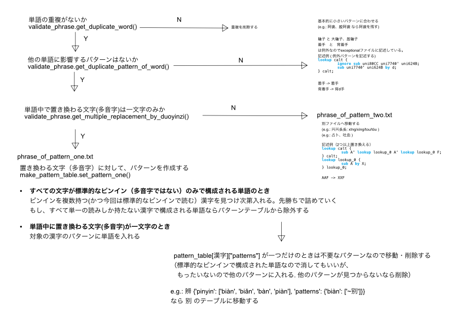
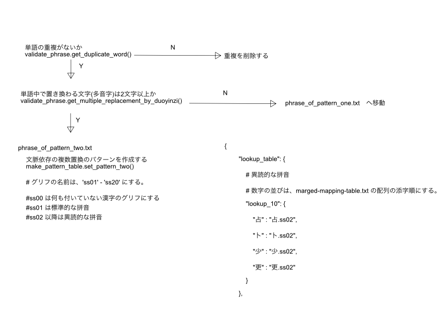

# 多音字について
pattern one は 熟語の中で 0~1 文字だけ拼音が変化するパターン  
pattern two は 熟語の中で 2 文字以上拼音が変化するパターン  
exception pattern は 例外的なパターン  

# ファイル構成
```
outputs
   ├── duoyinzi_pattern_one.txt          <- make_pattern_table.py によって生成される
   ├── duoyinzi_pattern_two.json         <- make_pattern_table.py によって生成される
   └── duoyinzi_exceptional_pattern.json <- 特別なパターンのみで使う（現在は、[ここ](./scripts/make_pattern_table.py)で手動にて生成している）
```


```
.
├── NOTE.md
├── phrase_of_exceptional_pattern.txt <- 例外的な置換パターンを含む熟語集（編集可能）  
├── phrase_of_pattern_one.txt         <- 熟語の中で 0~1文字だけ拼音が変化する熟語集（編集可能）  
├── phrase_of_pattern_two.txt         <- 熟語の中で 2文字以上拼音が変化する熟語集（編集可能）
├── phrase_testcase.txt               <- validate_phrase.py が有効的に働くかどうかの確認に使ったテストケース
└── scripts
    ├── check_exsit_duoyinsi_on_word.py
    ├── make_pattern_table.py
    ├── phrase.py
    ├── phrase_holder.py
    ├── pinyin_getter.py
    └── validate_phrase.py
```

# 生成手順
```
# 最初に辞書のチェックを行う
$ python validate_phrase.py

# パターンテーブル生成
$ python make_pattern_table.py 
```

## make_pattern_table.py の概略
  
  