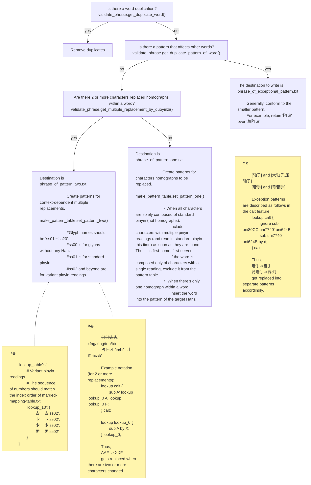

# About homograph (多音字)
- the pattern one is a pattern that pinyin changes only 0 to 1 character in an idiom.  
- the pattern two is patterns in which the pinyin changes for two or more characters in an idiom.  
- exception pattern is a pattern except above. 

# File Structure
```
outputs
   ├── duoyinzi_pattern_one.txt          <- Generated by make_pattern_table.py
   ├── duoyinzi_pattern_two.json         <- Generated by make_pattern_table.py
   └── duoyinzi_exceptional_pattern.json <- Used only for exceptional patterns
```
Currently, duoyinzi_exceptional_pattern.json is generated manually.
-> [Generation location](https://github.com/MaruTama/Mengshen-pinyin-font/blob/e5d6e9e1770d849d6c17016683faf7c04d028473/res/phonics/duo_yin_zi/scripts/make_pattern_table.py#L237-L276)

```
.
├── phrase_of_exceptional_pattern.txt <- Collection of idioms containing exceptional replacement patterns (Editable)
├── phrase_of_pattern_one.txt         <- Collection of idioms where only 0-1 characters change in pinyin (Editable)
├── phrase_of_pattern_two.txt         <- Collection of idioms where 2 or more characters change in pinyin (Editable)
├── phrase_testcase.txt               <- Test cases used to verify if validate_phrase.py works effectively
└── scripts
    ├── check_exsit_duoyinsi_on_word.py
    ├── make_pattern_table.py
    ├── phrase.py
    ├── phrase_holder.py
    ├── pinyin_getter.py
    └── validate_phrase.py
```

# Generation Procedure
```
# First, check the dictionary
$ python validate_phrase.py

# Generate pattern table
$ python make_pattern_table.py
```

## Overview of make_pattern_table.py

